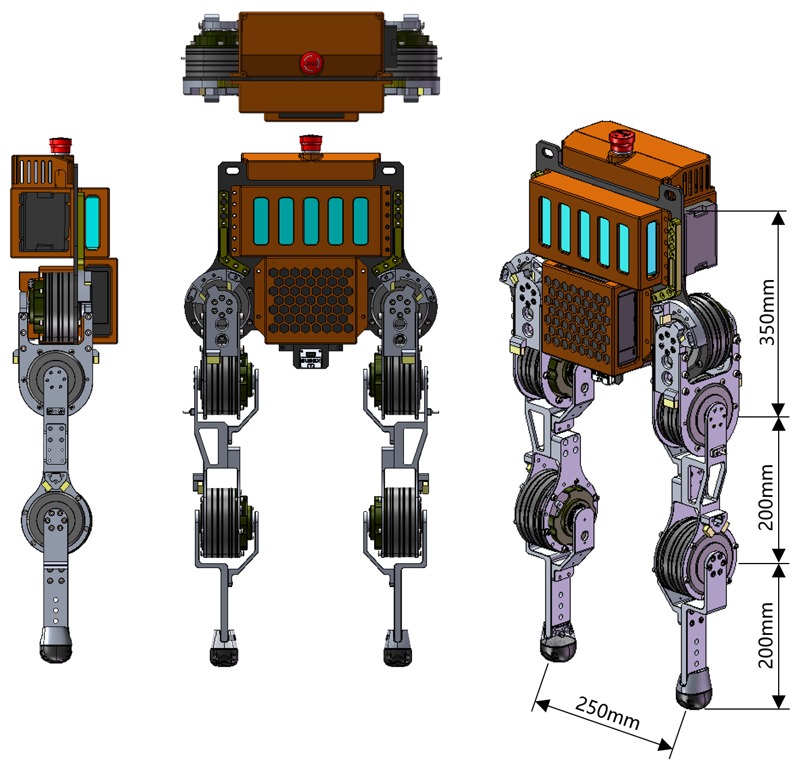

# STEPPER - Underactuated (Point-Foot) Bipedal Robot

## Overview

STEPPER is an underactuated point-foot bipedal robot designed for research in standing balance and whole-body angular momentum regulation. The project extends the "STANDER" research framework to legged systems, focusing on stability through momentum-based control rather than stepping strategies. The point-foot design eliminates ankle actuation, requiring the robot to maintain balance solely through angular momentum regulation.

## System Specifications

### Degrees of Freedom
- **Total Active DOF**: 6 (3 per leg)
- **Hip Joint**: 2 DOF (front/back, left/right swing)
- **Knee Joint**: 1 DOF (front/back swing)
- **Ankle Joint**: Point-foot contact (no active actuation)

### Physical Dimensions
- **Torso Height**: 350 mm
- **Thigh Length**: 200 mm
- **Shin Length**: 200 mm
- **Standing Width**: 250 mm

### Key Features
- Quasi-Direct Drive (QDD) motors for high torque density and transparency
- Dual-sided motor support for enhanced impact resistance and motor protection
- Symmetric design with no front/back distinction
- Shares the same electromechanical system and architecture as STANDER
- Open-source design (coming soon)

## Project Goals

The primary design goal is to achieve underactuated standing balance where stability relies on whole-body angular momentum regulation rather than stepping. This approach presents significant challenges for hardware-software co-design and requires:

- Precise actuator selection and placement
- Optimized mechanical design to support momentum-based control
- Advanced control algorithms for momentum management
- Robust sim-to-real transfer implementation

## Design Philosophy

STEPPER represents a departure from traditional bipedal robots that rely on stepping or flat-foot balance. By focusing on underactuated point-foot systems with momentum-based control, the project aims to:

- Reduce mechanical complexity through elimination of ankle actuation
- Improve energy efficiency by minimizing active degrees of freedom
- Enable more natural standing behaviors without reliance on foot placement
- Advance underactuated balance control without stepping

## License

This project is licensed under the MIT License.